# API Endpoints

Текстовое описание API. Формат передаваемых данных и response коды см. в файле [Swagger](swagger.json)

## GET /surveys

Возвращает список опросов указанной длины и с указанным отступом

#### Параметры:
- Count (Query) - количество опросов в списке
- Offset (Query) - отступ списка

#### Возвращает:
список опросов в JSON формате

## POST /surveys

Разместить опрос в системе

#### Тело запроса:
JSON опроса

#### Возвращает:
опрос в формате JSON со сгенерированным GUID

## GET /surveys/{publicationId}

Возвращает опрос с указанным GUID

#### Параметры:
- publicationId (Route) - GUID опроса

#### Возвращает:
опрос в формате JSON

## DELETE /surveys/{publicationId}

Удаляет опрос с указанным GUID

#### Параметры:
- publicationid (Route) - GUID опроса

## POST /surveys/{publicationId}/answers/{userId}

Добавляет ответ от пользователя на опрос

#### Параметры:
- publicationId (Route) - GUID опроса
- userId (Route) - логин пользователя

#### Тело запроса:
JSON ответа на опрос

#### Возщвращает:
JSON добавленного ответа на опрос

## PUT /surveys/{publicationId}/answers/{userId}

Изменяет ответ от пользователя на опрос

#### Параметры:
- publicationId (Route) - GUID опроса
- userId (Route) - логин пользователя

#### Тело запроса:
JSON ответа на опрос

#### Возщвращает:
JSON измененного ответа на опрос

## GET /surveys/{publicationId}/answers/{userId}

Возвращает ответ от пользователя на опрос

#### Параметры:
- publicationId (Route) - GUID опроса
- userId (Route) - логин пользователя

#### Возвращает:
JSON ответа на опрос

## DELETE /surveys/{publicationId}/answers/{userId}

Удаляет ответ от пользователя на опрос

#### Параметры:
- publicationId (Route) - GUID опроса
- userId (Route) - логин пользователя

# Тестирование API

## GET /surveys

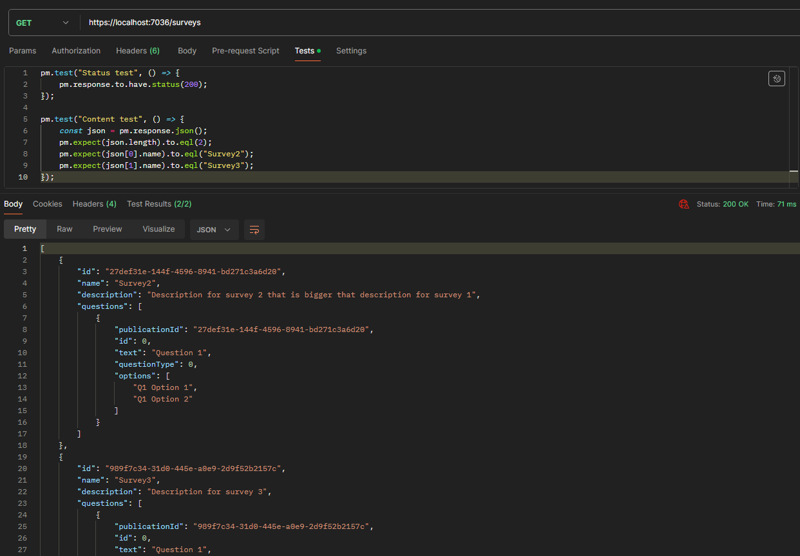

## POST /surveys

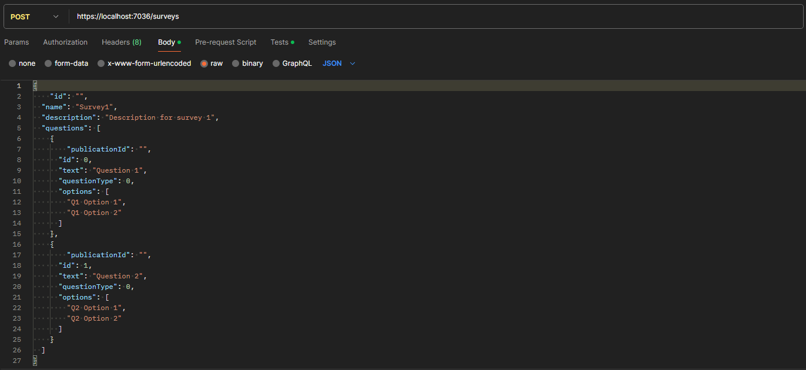

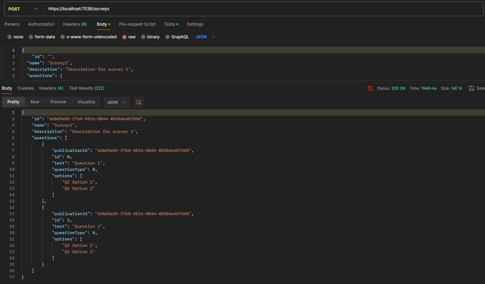

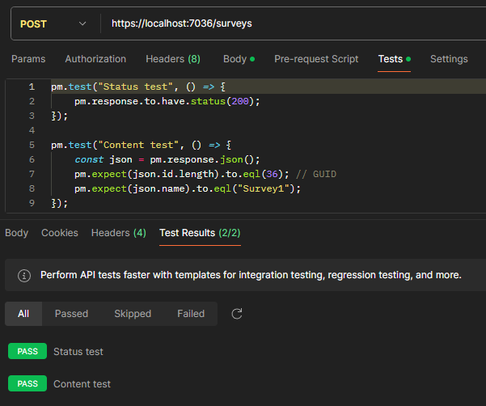

## GET /surveys/{publicationId}

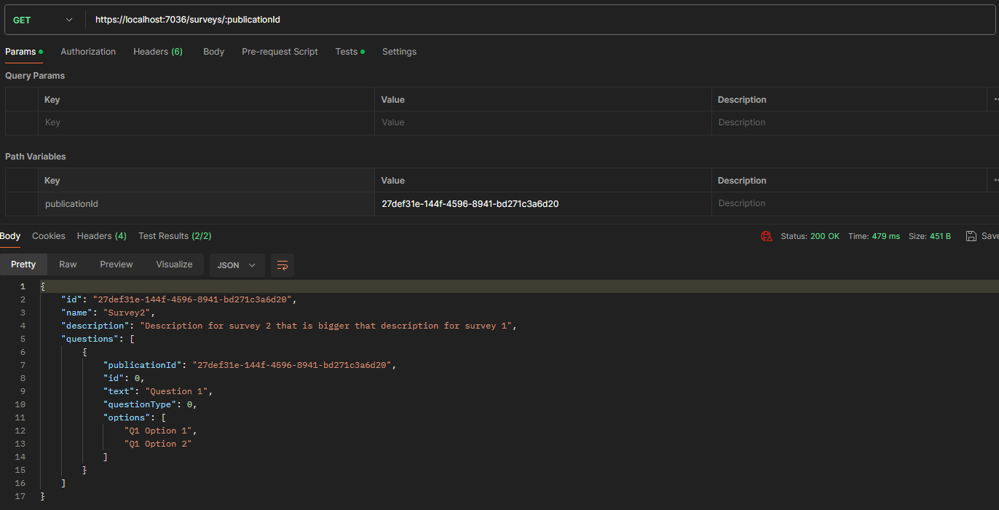

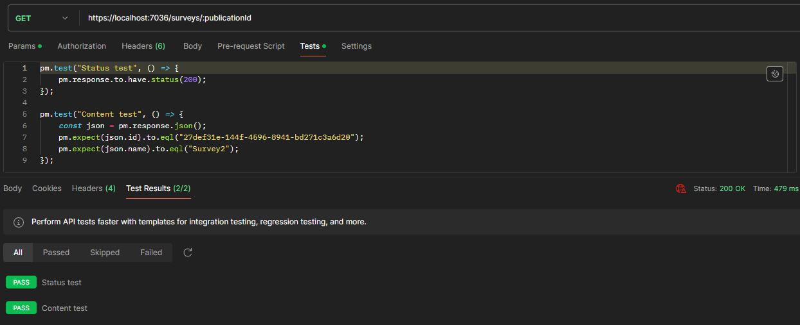

## DELETE /surveys/{publicationId}

Содержимое таблицы Surveys до выполнения (Survey1 - добавлен в предыдущем POST тесте):

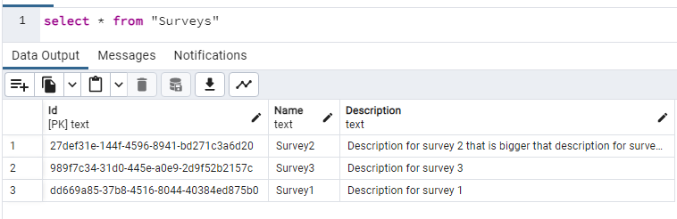

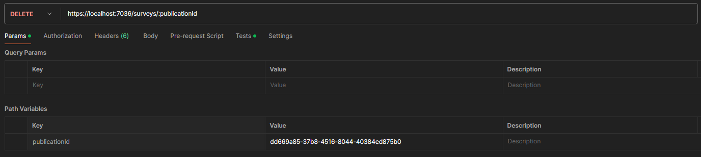

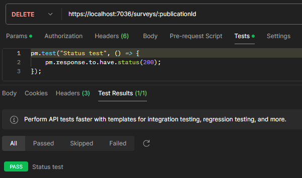

Содержимое таблицы Surveys после выполнения:

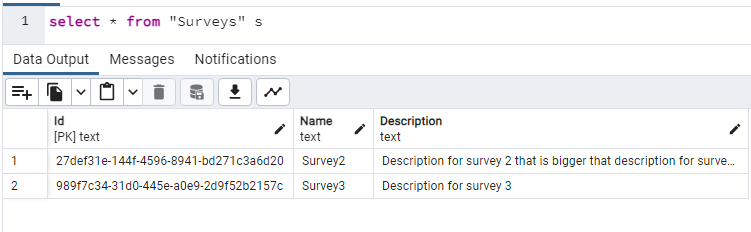

## POST /surveys/{publicationId}/answers/{userId}

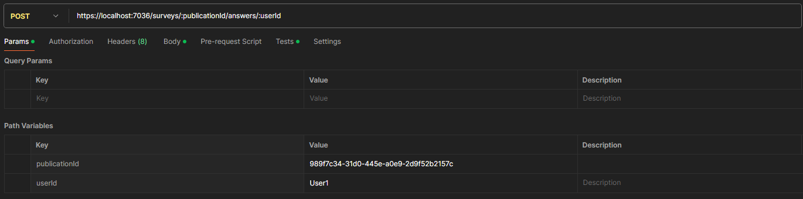

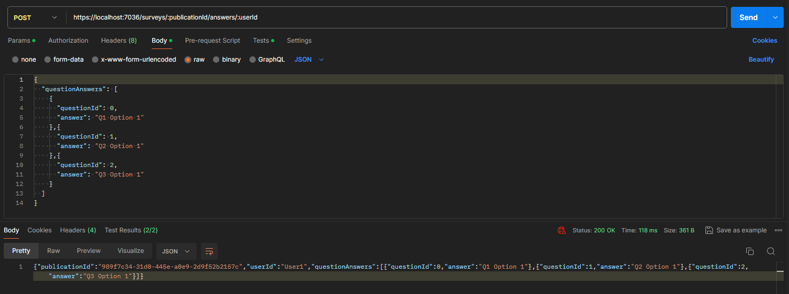

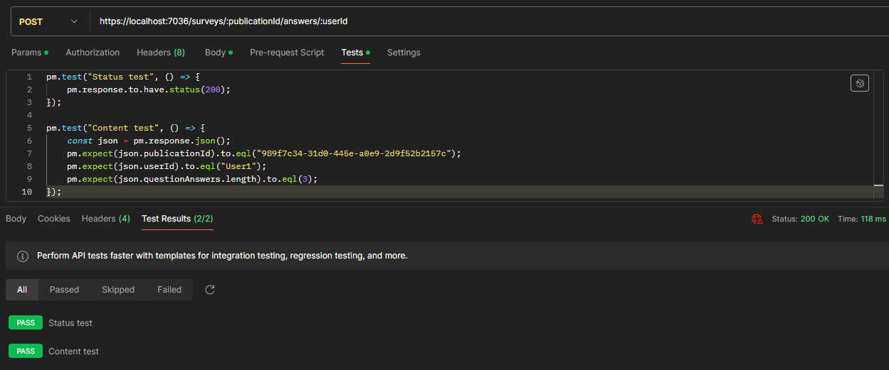

## PUT /surveys/{publicationId}/answers/{userId}

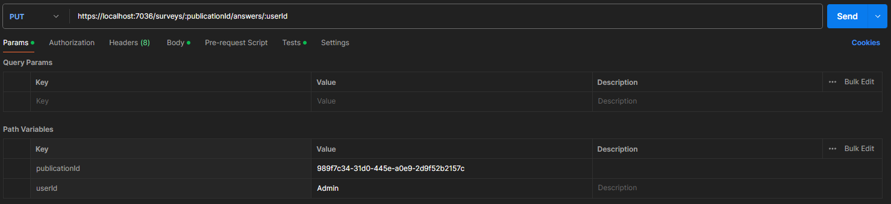

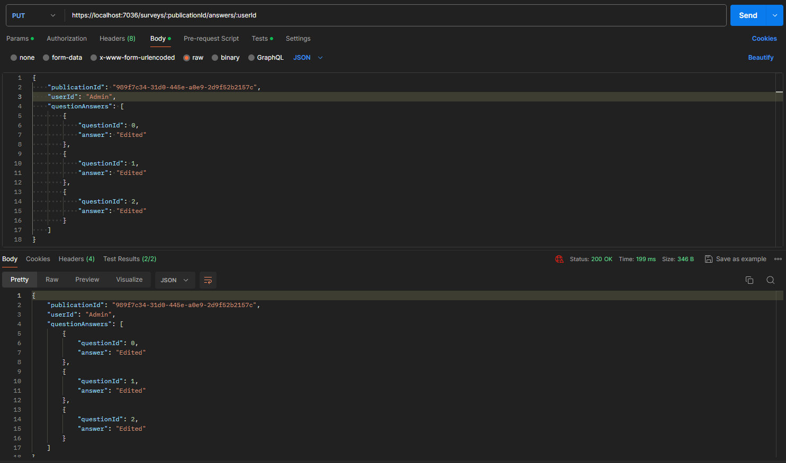

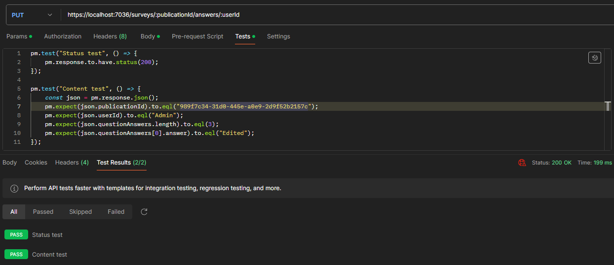

## GET /surveys/{publicationId}/answers/{userId}

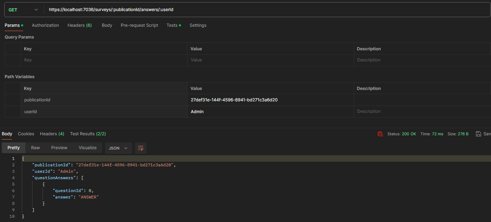

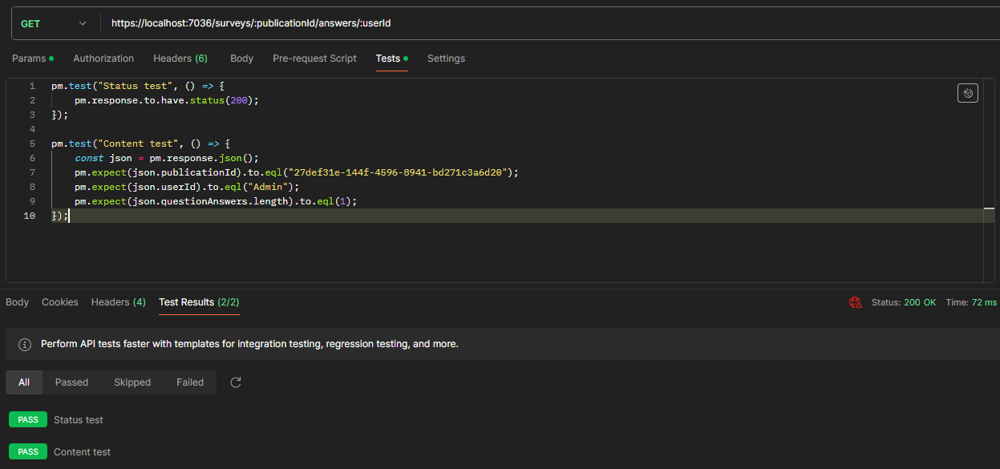