# Лабораторная работа № 6 - Шаблоны проектирования

## Порождающие шаблоны

### Фабричный метод / Factory Method

**Назначение:**  
Определяет интерфейс для создания объекта, но оставляет подклассам решение о том, какой класс инстанцировать.

В примере два вида опросов: выбор вариантов и соотношение вариантов с категориями. При реализации фабричного метода появляется возможность расширять список видов опросов, при этом не изменяя логику создания объектов, а создавая для этого новые фабрики

**UML:**  

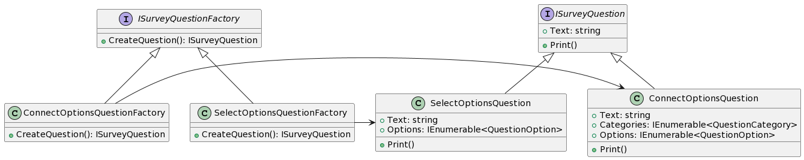

**Код:**

```csharp

public interface ISurveyQuestion
{
    public void Print();
    public string Text { get; set; }
}

public class SelectOptionsQuestion : ISurveyQuestion
{
    public string Text { get; set; }
    public IEnumerable<QuestionOption> Options;

    public void Print()
    {
        string res = Text;
        res += "\nВарианты:\n";
        foreach(var option in Options)
            res += QuestionOption.ToString() + "\n";
        Console.WriteLine(res);
    }
}

public class ConnectOptionsQuestion : ISurveyQuestion
{
    public string Text { get; set; }
    public IEnumerable<QuestionCategory> Categories;
    public IEnumerable<QuestionOption> Options;

    public void Print()
    {
        string res = Text;

        res = "\nКатегории:\n";
        foreach(var category in Categories)
            res += category.ToString() + "\n";

        res += "\nВарианты:\n";
        foreach(var option in Options)
            res += option.ToString() + "\n";

        Console.WriteLine(res);
    }
}

public interface ISurveyQuestionFactory
{
    public ISurveyQuestion CreateQuestion();
}

public SelectOptionsQuestionFactory : ISurveyQuestionFactory
{
    public ISurveyQuestion CreateQuestion()
    {
        return new SelectOptionsQuestion();
    }
}

public ConnectOptionsQuestionFactory : ISurveyQuestionFactory
{
    public ISurveyQuestion CreateQuestion()
    {
        return new ConnectOptionsQuestion();
    }
}

class Program
{
    static void Main()
    {
        ISurveyQuestionFactory factory = new SelectOptionsQuestionFactory();
        factory.CreateQuestion().Print();

        factory = new ConnectOptionsQuestion();
        factory.CreateQuestion().Print();
    }
}

```

### Строитель / Builder

**Назначение:**  
Инкапсулирует создание объекта и позволяет разделить его на различные этапы

В примере паттерн используется для создания опроса. Полезен т.к. существует множество опций создания опроса, а также нежелательно, чтобы была возможность изменения опроса после его создания

**UML:**  

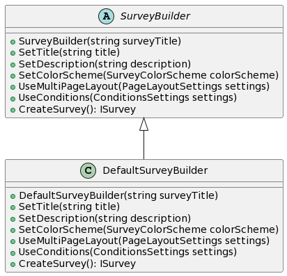

**Код:**

```csharp

public abstract class SurveyBuilder
{
    public SurveyBuilder(string surveyTitle)
    {
        SetTitle(title);
    }

    public abstract void SetTitle(string title);
    public abstract void SetDescription(string description);
    public abstract void SetColorScheme(SurveyColorScheme colorScheme);


    public abstract void UseMultiPageLayout(PageLayoutSettings settings);
    public abstract void UseConditions(ConditionsSettings settings);

    public abstract ISurvey CreateSurvey();
}

public class DefaultSurveyBuilder : ISurveyBuilder
{
    public DefaultSurveyBuilder(string surveyTitle) : base(surveyTitle)
    {

    }

    public override void SetTitle(string title) { /* ... */ }
    public override void SetDescription(string description) { /* ... */ }
    public override void SetColorScheme(SurveyColorScheme colorScheme) { /* ... */ }
    public override void UseMultiPageLayout(PageLayoutSettings settings) { /* ... */ }
    public override void UseConditions(ConditionsSettings settings) { /* ... */ }

    public override ISurvey CreateSurvey() { /* ... */ }
}

public interface ISurvey
{
    // ...
}

class Program
{
    static void Main()
    {
        SurveyBuilder surveyBuilder = new DefaultSurveyBuilder("Simple survey");
        surveyBuilder.SetDescription("Simple survey description");
        ISurvey = surveyBuilder.CreateSurvey();

        surveyBuilder = new DefaultSurveyBuilder("Complex survey");
        surveyBuilder.SetDescription("Complex survey description");
        surveyBuilder.UseMultiPageLayout(new PageLayoutSettings() { /* ... */ });
        surveyBuilder.UseConditions(new ConditionsSettings() { /* ... */ });
        surveyBuilder.SetColorScheme(ColorSchemes.Dark);
        surveyBuilder.CreateSurvey();
    }
}

```

### Одиночка / Singleton

**Назначение:**  
Гарантирует, что у класса есть только один экземпляр и предоставляет к нему глобальную точку доступа.

В примере глобальные настройки, которые могут содержать константы, используемые во многих частях системы

**UML:**  

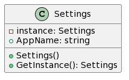

**Код:**

```csharp
using System;

public class Settings
{
    private static Settings instance;
    
    public string AppName { get; }
    // ...
    
    private Settings()
    {
        AppName = "MyApp";
        //...
    }
    
    public static Settings GetInstance()
    {
        if (instance == null)
        {
            instance = new Settings();
        }
        
        return instance;
    }
}
```


## Структурные шаблоны

### Адаптер / Adapter

**Назначение:**  
Преобразует интерфейс одного класса в интерфейс другого, который ожидают клиенты. Адаптер делает возможной совместную работу классов с несовместимыми интерфейсами.

В примере преобразую опрос к выводимому на печать. Могло бы быть полезно, когда сразу большое количество объектов выводится на печать и опрос нужно поместить вместе с ними в коллекцию.

**UML:**  

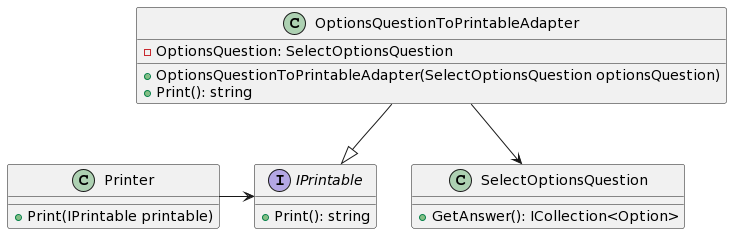

**Код:**
```csharp

public class SelectOptionsQuestion
{
    public ICollection<Option> GetAnswer();
}

public interface IPrintable
{
    public string Print();
}

public class OptionsQuestionToPrintableAdapter : IPrintable
{
    private SelectOptionsQuestion OptionsQuestion { get; }
    public OptionsQuestionToPrintableAdapter(SelectOptionsQuestion optionsQuestion)
    {
        OptionsQuestion = optionsQuestion;
    }

    public string Print()
    {
        string res = string.empty;
        foreach (var option in OptionsQuestion.GetAnswer()){
            res += option.ToString() + "\n";
        }
        Console.WriteLine(res);
    }
}

public class Printer
{
    public void Print(IPrintable printable)
    {
        printable.Print();
    }
}

class Program
{
    static void Main()
    {
        SelectOptionsQuestion optionsQuestion = new();
        Printer printer = new();

        // ...

        PrintableQuestion printableOptionsQuestion = OptionsQuestionToPrintableAdapter(optionsQuestion);
        printer.Print(printableOptionsQuestion);
    }
}
```

### Фасад / Facade

**Назначение:**  
Позволяет скрыть сложность системы с помощью предоставления упрощенного интерфейса для взаимодействия с ней.

В примере привожу модуль для получения опросов. Т.к. это сложный процесс, который требует взаимодействия нескольких прочих классов, логику объединяю в отдельный класс, который предоставляет одну точку для взаимодействия. Благодаря этому получать опросы становится проще, а кроме того их можно получать даже не имея в контексте необходимых для этого классы.

**UML:**  

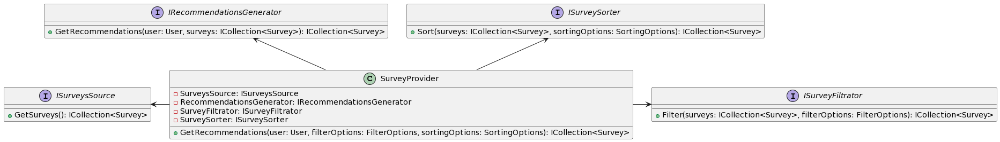

**Код:**

```csharp

public class SurveyProvider
{
    private ISurveysSource SurveysSource { get; set; }
    private IRecommendationsGenerator RecommendationsGenerator { get; set; }
    private ISurveyFiltrator SurveyFiltrator { get; set; }
    private ISurveySorter SurveySorter { get; set; }

    public ICollection<Survey> GetRecommendations(
        User user, 
        FilterOptions? filterOptions = null,
        SortingOptions? sortingOptions = null)
    {
        ICollection<Survey> surveys = SurveysSource.GetSurveys().Where(s => s.user=user);
        if (filterOptions is not null)
            surveys = SurveyFiltrator.Filter(surveys, filterOptions);
        surveys = RecommendationsGenerator.GetRecommendations(user, surveys);
        if (sortingOptions is not null)
            surveys = SurveySorter.Sort(sortingOptions);
        return surveys;
    }
}
```

### Декоратор / Decorator

**Назначение:**  
Динамически добавляет объекту новые возможности. Является гибкой альтернативой наследованию для расширения функциональности.

В примере привожу объекты для валидации. Может существовать множество механизмов валидации, которые зачастую должны применяться одновременно. Декоратор позволяет настраивать сложную логику из простых объектов, при этом сохраняя возможность добавлять новые способы валидации.

**UML:**  

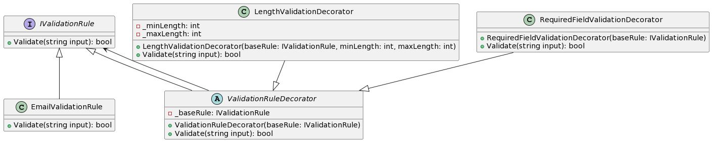

**Код:**
```csharp

public interface IValidationRule
{
    bool Validate(string input);
}

public class EmailValidationRule : IValidationRule
{
    public bool Validate(string input)
    {
        return input.Contains("@") && input.Contains(".");
    }
}

public abstract class ValidationRuleDecorator : IValidationRule
{
    protected readonly IValidationRule _baseRule;

    public ValidationRuleDecorator(IValidationRule baseRule)
    {
        _baseRule = baseRule;
    }

    public abstract bool Validate(string input);
}

public class LengthValidationDecorator : ValidationRuleDecorator
{
    private readonly int _minLength;
    private readonly int _maxLength;

    public LengthValidationDecorator(IValidationRule baseRule, int minLength, int maxLength) : base(baseRule)
    {
        _minLength = minLength;
        _maxLength = maxLength;
    }

    public override bool Validate(string input)
    {
        if (input.Length < _minLength || input.Length > _maxLength)
        {
            return false;
        }
        return _baseRule.Validate(input);
    }
}

public class RequiredFieldValidationDecorator : ValidationRuleDecorator
{
    public RequiredFieldValidationDecorator(IValidationRule baseRule) : base(baseRule) { }

    public override bool Validate(string input)
    {
        if (string.IsNullOrWhiteSpace(input))
        {
            return false;
        }
        return _baseRule.Validate(input);
    }
}

class Program
{
    static void Main()
    {
        IValidationRule emailValidationRule = new EmailValidationRule();

        IValidationRule decoratedValidationRule = new RequiredFieldValidationDecorator(new LengthValidationDecorator(emailValidationRule, 5, 50));

        string email = "example@email.com";
        bool isValid = decoratedValidationRule.Validate(email);

        Console.WriteLine($"Is email valid? {isValid}");
    }
}
```

### Прокси / Proxy

**Назначение:**  

Предоставляет объект-заместитель, который управляет доступом к другому объекту.

Пример защищённого опроса. Может быть полезно, когда необходимо передать опрос в новый контекст, где отсутствует информация о правах пользователя.

**UML:**  

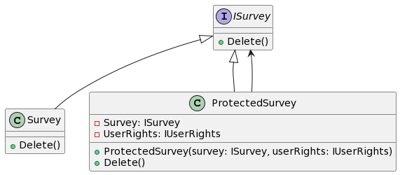

**Код:**


```csharp

public interface ISurvey
{
    public void Delete();
}

public class Survey : ISurvey
{
    public void Delete()
    {
        // ...
    }
}

// Прокси
public class ProtectedSurvey : ISurvey
{
    private ISurvey Survey { get; }
    private IUserRights UserRights { get; }

    public ProtectedSurvey(ISurvey survey, IUserRights userRights)
    {
        Survey = survey;
    }

    public void Delete()
    {
        if (UserRights.CanDelete(Survey))
            Survey.Delete();
    }
}
```

### Компоновщик / Composite

**Назначение:**  
Компонует объекты в древовидные структуры для представления иерархий «часть — целое». Позволяет клиентам единообразно трактовать индивидуальные и составные объекты.

В примере объединение опросов в группы. Полезно т.к. существует множество видов групп, а также они могут содержать друг друга

**UML:**  

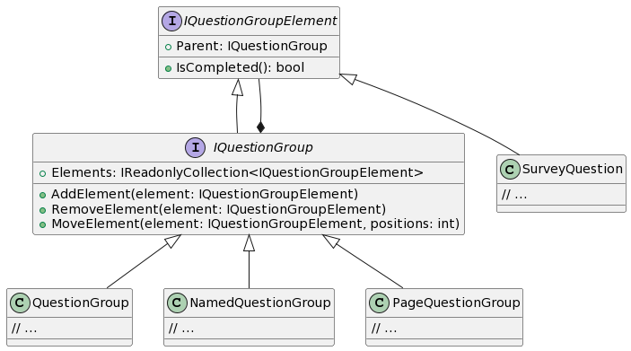

**Код:**

```csharp

public interface IQuestionGroupElement
{
    public IQuestionGroup Parent { get; }

    public bool IsCompleted();
}

public interface IQuestionGroup : IQuestionGroupElement
{
    public IReadonlyCollection<IQuestionGroupElement> Elements { get; }

    public void AddElement(IQuestionGroupElement element);
    public void RemoveElement(IQuestionGroupElement element);
    public void MoveElement(IQuestionGroupElement element, int positions);
}

public class SurveyQuestion : IQuestionGroupElement
{
    // ...
}

public class QuestionGroup : IQuestionGroup
{
    // ...
}

public class NamedQuestionGroup : IQuestionGroup
{
    // ...
}

public class PageQuestionGroup : IQuestionGroup
{
    // ...
}

class Program
{
    static void Main()
    {
        IQuestionGroup root = new PageQuestionGroup();
        IQuestionGroup group1 = new QuestionGroup();
        group1.AddElement(new SurveyQuestion());
        group1.AddElement(new SurveyQuestion());
        root.AddElement(group1);
        root.AddElement(new SurveyQuestion());
    }
}

```

## Поведенческие шаблоны

### Стратегия / Strategy

**Назначение:**  
Определяет семейство алгоритмов, инкапсулирует каждый из них и делает их взаимозаменяемыми. Стратегия позволяет изменять алгоритмы независимо от клиентов, которые ими пользуются.

Пример стратегии фильтрации. Позволяет фильтровать по различным параметрам опроса, при этом сохраняя единый интерфейс. Благодаря этому элементы удобно хранить в коллекциях и применять одновременно.

**UML:**  

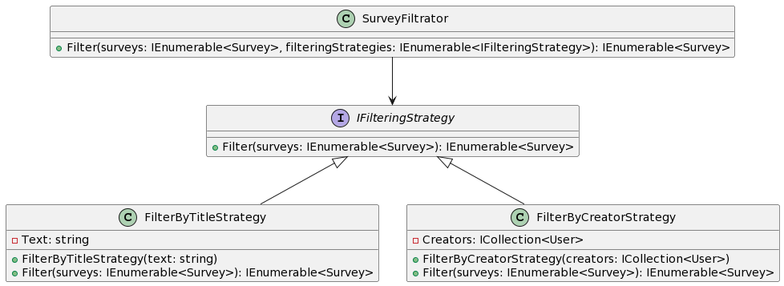

**Код:**

```csharp

public interface IFilteringStrategy
{
    public IEnumerable<Survey> Filter(IEnumerable<Survey> surveys);
}

public class FilterByTitleStrategy : IFilteringStrategy
{
    private string Text { get; }
    public FilterByTitleStrategy(string text)
    {
        Text = text;
    }

    public IEnumerable<Survey> Filter(IEnumerable<Survey> surveys)
    {
        return surveys.Where(s => s.Title.Contains(Text));
    }
}

public class FilterByCreatorStrategy : IFilteringStrategy
{
    private ICollection<User> Creators { get; }

    public FilterByCreatorStrategy(ICollection<User> creators)
    {
        Creators = creators;
    }

    public IEnumerable<Survey> Filter(IEnumerable<Survey> surveys)
    {
        return surveys.Where(s => Creators.Contains(s.Creator));
    }
}

public class SurveyFiltrator
{
    public IEnumerable<Survey> Filter(IEnumerable<Survey> surveys, IEnumerable<IFilteringStrategy> filteringStrategies)
    {
        IEnumerable result = new List<Survey>(surveys);
        foreach(var strategy in filteringStrategies)
        {
            result = strategy.Filter(result);
        }
        return result;
    }
}

class Program
{
    private SurveyFiltrator SurveyFiltrator { get; } 
    private IEnumerable<Survey> Surveys { get; }
    private IEnumerable<User> Users { get; }

    static void Main()
    {
        List<IFilteringStrategy> filters = new();
        filters.Add(new FilterByTitleStrategy("MySurvey"));
        filters.Add(new FilterByCreatorStrategy(Users));

        SurveyFiltrator.Filter(Surveys, filters);
    }
}
```

### Итератор / Iterator

**Назначение:**  
Предоставляет абстрактный интерфейс для последовательного доступа ко всем элементам составного объекта без раскрытия его внутренней структуры

В примере создаётся итератор для вопросов, где опрос является итерируемым объектом. Пример упрощённый, в проекте планируется более сложная структура хранения вопросов, которую уже будет не так просто перебирать, и в этом случае итератор будет очень полезен. Использую встроенные интерфейсы IEnumerator и IEnumerable

**UML:**  

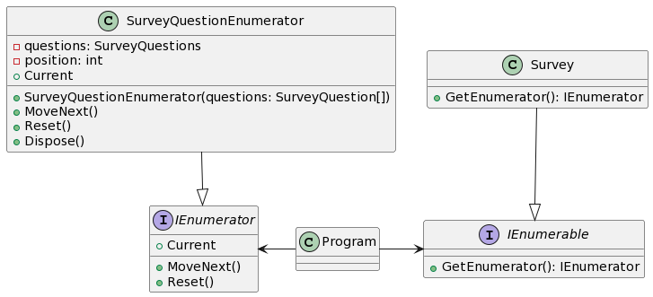

**Код:**


```csharp

class SurveyQuestionEnumerator : IEnumerator<SurveyQuestion>
{
    SurveyQuestions questions;
    int position = -1;
    public WeekEnumerator(SurveyQuestion[] questions) => this.questions = questions;

    public string Current
    {
        get
        {
            if (position == -1 || position >= questions.Length)
                throw new ArgumentException();
            return questions[position];
        }
    }
    object IEnumerator.Current => Current;
    public bool MoveNext()
    {
        if (position < questions.Length - 1)
        {
            position++;
            return true;
        }
        else
            return false;
    }
    public void Reset() => position = -1;
    public void Dispose() { }
}

public class Survey : IEnumerable<SurveyQuestion>
{
    private ICollection<SurveyQuestion> Questions { get; }

    public IEnumerator<SurveyQuestion> GetEnumerator()
    {
        return new SurveyQuestionEnumerator(Questions);
    }

    private IEnumerator GetEnumerator1()
    {
        return this.GetEnumerator();
    }
    IEnumerator IEnumerable.GetEnumerator()
    {
        return GetEnumerator1();
    }
}

class Program
{
    private ISurvey Survey { get; } 

    static void Main()
    {
        foreach(var question in Survey){
            Console.WriteLine(question.ToString());
        }
    }
}
```

### Команда / Command

**Назначение:**  
Позволяет инкапсулировать запрос на выполнение определенного действия в виде отдельного объекта При этом объекты, инициирующие запросы на выполнение действия, отделяются от объектов, которые выполняют это действие.

В примере реализация условного перехода опроса, который выполняется при нажатии на кнопку далее после ответа на вопрос. При создании опроса указывается ряд команд, которые должны выполниться по определённому условию. Соответственно при прохождении опроса эти команды выполняются, если условие оказывается истинным

**UML:**  

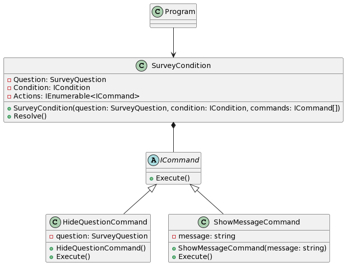

**Код:**

```csharp

public abstract class ICommand
{
    public abstract void Execute();
}

public class HideQuestionCommand : ICommand
{
    private SurveyQuestion question;
    public HideQuestionCommand()
    {
        this.question = question;
    }

    public void Execute() 
    {
        question.Hidden = true;
    }
}

public class ShowMessageCommand : ICommand
{
    private string message;
    public ShowMessageCommand(string message)
    {
        this.message = message;
    }

    public void Execute()
    {
        Console.WriteLine(message);
    }
}

public class SurveyCondition
{
    private SurveyQuestion Question { get; }
    private ICondition Condition { get; }
    private IEnumerable<ICommand> Actions { get; }

    public SurveyCondition(SurveyQuestion question, ICondition condition, params ICommand[] commands)
    {
        Question = question;
        Condition = condition;
        Actions = commands;
    }

    public void Resolve()
    {
        if (Condition.Resolve(Question))
            foreach(var action in Actions)
                action.Execute();
    }
}

class Program
{
    private ISurvey Survey { get; } 

    static void Main()
    {
        SurveyCondition = new(
            new HasAnswerCondition(), 
            new HideQuestionCommand(Survey.Questions[1]),
            new ShowMessageCommand("Some message"));

        // ...

        SurveyCondition.Resolve();
    }
}

```

### Хранитель / Memento

**Назначение:**  
Позволяет выносить внутреннее состояние объекта за его пределы для последующего возможного восстановления объекта без нарушения принципа инкапсуляции

Пример для конструирования опроса: изменения сохраняются в истории и могут откатываться назад при необходимости. Также можно сохранить состояние в хранилище, чтобы восстановить его при повторном входе в систему.

**UML:**  

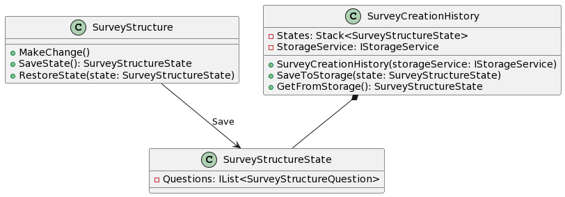

**Код:**

```csharp

public class SurveyStructure
{
    public void MakeChange()
    {
        // ...
    }

    public SurveyStructureState SaveState()
    {
        SurveyStructureState state = new();

        // ...

        return state;
    }

    public void RestoreState(SurveyStructureState state)
    {
        // ...
    }
}

public class SurveyStructureState
{
    public IList<SurveyStructureQuestion> Questions { get; }

    public SurveyStructureState()
    {
        Questions = new();
    }
}

public class SurveyCreationHistory
{
    public Stack<SurveyStructureState> States { get; }
    private IStorageService StorageService { get; }
    public SurveyCreationHistory(IStorageService storageService)
    {
        States = new();
    }

    public void SaveToStorage(SurveyStructureState state)
    {
        StorageService.Save("SurveyConstructed", JsonSerializer.Serialize(state));
    }

    public SurveyStructureState GetFromStorage()
    {
        string? value = StorageService.Get("SurveyConstructed");
        if(value is not null)
            return JsonSerializer.Deserialize<SurveyStructureState>();
        throw new Exception();
    }
}

class Program
{
    static void Main()
    {
        SurveyStructure survey = new();
        SurveyCreationHistory history = new(new FileService());

        survey.MakeChange();
        
        history.States.Push(survey.SaveState());
        survey.MakeChange();
        history.States.Push(survey.SaveState());
        survey.MakeChange();
        survey.RestoreState(history.States.Pop());

        history.SaveToStorage(history.States.Peek());
    }
}

```

