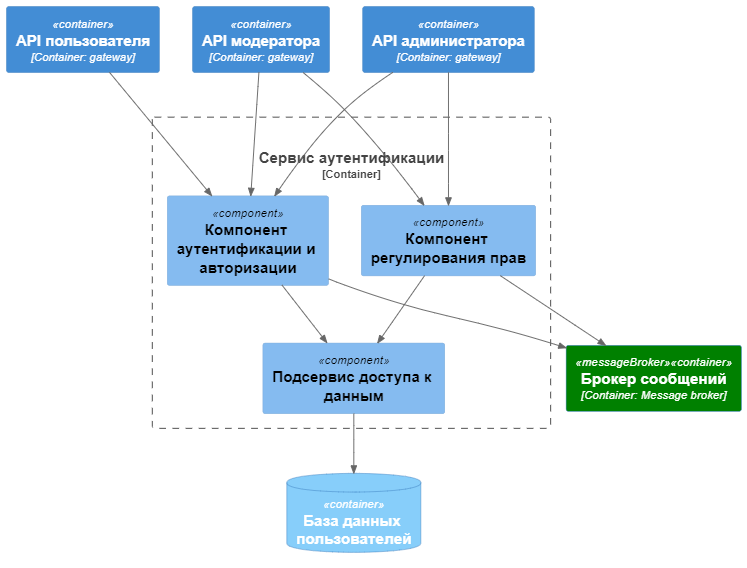
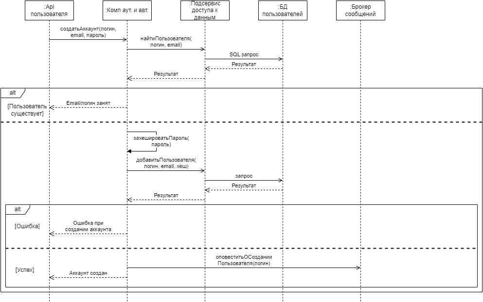
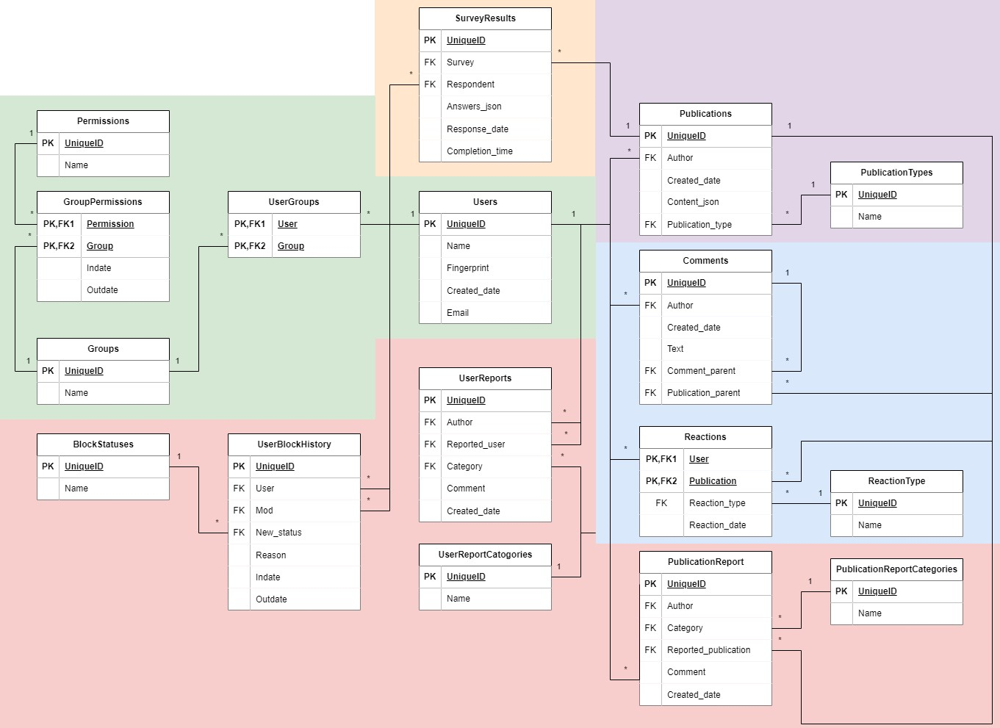

# Лабораторная работа №3

## Диаграмма компонентов

## Диаграмма последовательностей

На диаграмме изображена последовательность сообщений для прецедента "Создание аккаунта".

## Схема базы данных

Так как реализуется микросервисная архитектура, структура хранилища данных также будет распределенной (и скорее всего no-sql). Однако чтобы лучше продемонстрировать сущности и связи между ними, на диаграмме приведена единая схема реляционной бд. Принадлежность сущностей к разным доменам обозначена разными цветами. Зеленым обозначен домен, соответствующий микросервису аутентификации

## Принципы разработки

В файле EXAMPLE.cs приведен пример реализации прецедентов регистрации и входа в аккаунт(лишь схематично, в реальном проекте все бы очень сильно отличалось). При регистрации хэшируется пароль, добавляется запись с новым пользователем в БД. При входе в аккаунт проверяется принадлежность аккаунта пользователю и создаётся токен доступа.

#### DRY

Согласно принципу повторяющиеся фрагменты кода должны оборачиваться в функции. В данном примере и при регистрации и при входе в аккаунт необходимо получить пользователя из БД (в первом случае для того, чтобы удостовериться, что логин не занят, а во втором, чтобы получить хранимый в БД отпечаток пароля). Чтобы соблюсти принцип DRY, создаём отдельную функцию `GetUserByLogin` (в примере она вынесена в интерфейс `IUserRepository`).

#### KISS

Принцип призывает писать как можно более простой код. В примере это достигается вынесением сложной логики в отдельные функции и классы/интерфейсы (хэширование пароля, создание токена доступа).

#### YAGNI

Не нужно писать код, который не будет использоваться. В данном примере все функции, классы и интерфейсы необходимы для реализации заданной функциональности. 

#### Single responsibility principle

У класса должна быть единственная причина для изменения. В примере это реализовано путем вынесения логики доступа к данным, хэширования и создания токенов в отдельные интерфейсы. Благодаря этому `AuthService` будет изменяться только когда необходимо изменить непосредственно алгоритм регистрации или создания аккаунта. При изменении логики доступа к данным, хэширования и создания токенов необходимо будет изменять соответствующие классы.

#### Open closed principle

Классы должны быть открыты для расширения, но закрыты для модификации. Реализован путем вынесения логики доступа к данным, хэширования и создания токенов в отдельные интерфейсы. Соответственно при необходимости изменения логики создания токенов доступа (например, вместо JWT зачем-то понадобится использовать что-то другое), то будет создана отдельная реализация интерфейса, и код, который полагается на `ITokenizer` не будет затронут.

#### Liskov substitution principle

Функции, которые используют базовый тип, должны иметь возможность использовать подтипы базового типа, не зная об этом. Реализация аналогична предыдущему пункту: можно заменить способ создания и проверки токенов путем использования другой реализации интерфейса.

#### Interface segregation principle

Классы не должны зависеть от методов, которые они не используют. В примере это реализовано путем использования максимально специфичных интерфейсов. Принцип мог бы быть нарушен, если бы, к примеру, в интерфейс `IPasswordEncoder` была бы добавлена функция для сохранения хэша в файл. Эта функция не нужна в классе `AuthService` и в будущем её изменение потенциально могло бы повлиять на логику действительно нужных функций.

#### Dependency inversion principle

Модули верхнего уровня не должны зависеть от модулей нижнего уровня, а должны полагаться на абстракции. Для реализации использован механизм Dependency Injection в конструкторе класса `AuthService`. При создании экземпляра должны быть указаны реализации интерфейсов `IUserRepository`, `IPasswordEncoder`, `ITokenizer`. Благодаря этому изменение, например, логики создания токенов доступа не сможет привести к изменению класса `AuthService`: в интерфейсе строго определены используемые функции, и класс, реализующий интерфейс, обязан будет под них подстроиться.
